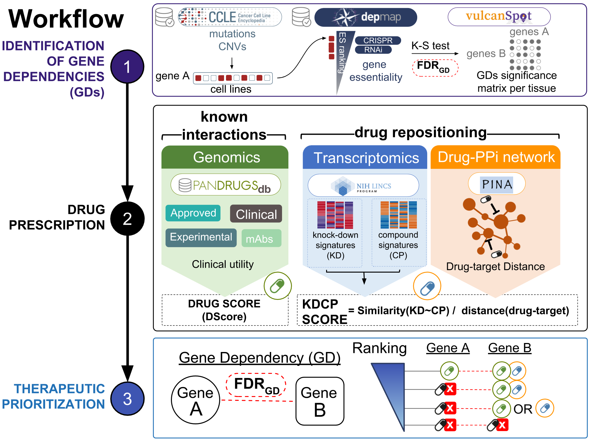

# vulcanspot
a tool to prioritize therapeutic vulnerabilities in cancer

## Graphical abstract

## Abstract
Genetic alterations lead to tumour progression and survival in cancer, but also uncover gene dependencies such as oncogenic addictions and synthetic lethals, which could be exploited to extend the current catalog of molecularly matched treatments for precision medicine. VulcanSpot is a novel computational approach that exploits the notion of collateral therapeutic vulnerabilities caused by the acquisition of cancer mutations. To this aim, our method mines genomic profiles from cancer cell lines and genome-wide gene loss-of-function screenings to identify potential vulnerabilities in cancer. Then, vulcanSpot prioritizes drugs to target genotype-selective gene dependencies using a weighted scoring system that integrates two complementary strategies for computational drug prescription: i) Pandrugs - a comprehensive database of known gene-drug relationships, and ii) a novel drug repositioning method that matches drugs whose transcriptional signature mimics the functional depletion of the target gene.

## Requirements
* bash (UNIX)
* sed (UNIX)
* find (UNIX)
* python2.7 (UNIX)
* R (UNIX)
- - - 
Most of the pipeline is based on R (recommended version 3.4.4).
R packages:
| package name | source | Recommended version |
| `biomaRt` | Bioconductor | 2.34.2 |
| `GenomicFeatures` | Bioconductor | 1.30.3 |
| `SCAN.UPC` | Bioconductor | 2.20.0 |
| `fgsea` | Bioconductor | 1.4.1 |
| `igraph` | Bioconductor | 1.2.2 |
| `reshape2` | CRAN | 1.4.3 |
| `mygene` | Bioconductor | 1.14.0 |
